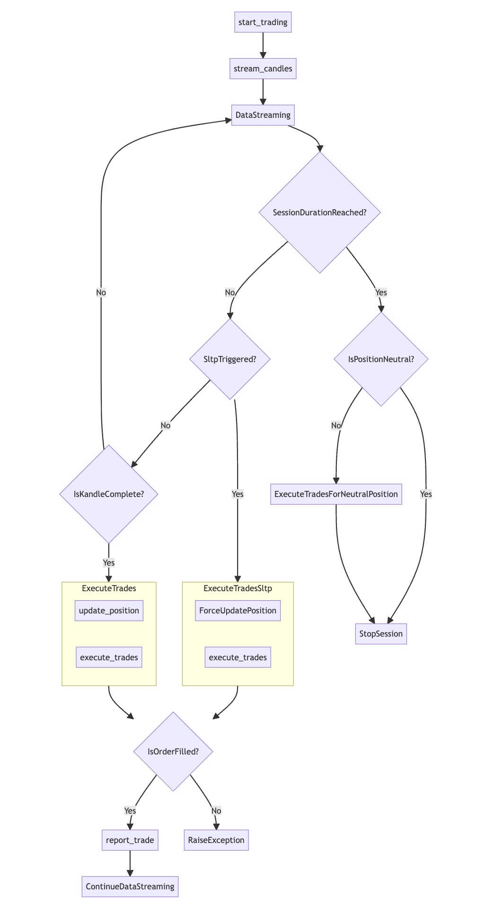

<h1 align="center">Portfolio Use Only</h1>

> :warning: **Important Note**

This repository and its contents, including installation and deployment instructions, are provided for portfolio review and demonstration purposes only. While the repository is publicly viewable and its code can be executed for review purposes, no license is granted for any further use, distribution, or reproduction of the materials contained herein. Any such activities are prohibited without express permission from the repository owner. Please contact the owner for any questions or requests for use.

# binance-futures-trading-bot

## Description

This project is a cryptocurrency bot, developed in Python and run using a Jupyter Notebook. The bot operates on the Binance Futures API and utilizes two technical indicators to formulate trading signals:

- **MACD (Moving Average Convergence Divergence)**: This indicator identifies potential buy and sell signals that are to be confirmed by the other indicator. The indicator sends 2 types of signals:
  
  1. Buy/sell signal: when the fast EMA crosses above the slow SMA a buy signal is generated (conversely for a sell signal), to be confirmed by the MACD buy confirmation signal.
  2. Buy/sell confirmation: upon a buy signal from MACD indicator, the confirmation takes place when the fast MA is located above the slow MA (conversely for a sell confirmation.
  
- **Moving Averages (SMA & EMA)**: This indicator identifies potential buy and sell signals that are to be confirmed by the other indicator. The indicator sends 2 types of signals:

  1. Buy/sell signal: when the MACD crosses the 0 line above, a buy signal is generated (conversely for sell signal)
  2. Buy/sell confirmation: upon a buy signal from the MA indicators, if the macd is above the 0 line this would confirm the buy signal (conversely for a sell signal)

Note: Conversely, the same applies for a sell signal

## Table of Contents

- [Installation](#installation)
- [Flowchart](#flowchart)
- [Technologies](#technologies)
- [Trading Indicators](#trading-indicators)
- [Contact](#contact)

## Installation
Before you begin, ensure you have met the following requirements:

### Prerequisites

- You have installed [Jupyter Notebook](https://jupyter.org/install)

To install and use the Trading Bot, follow these steps:


1. Clone the repository
```
git clone https://github.com/jparraporcar/binance-futures-trading-bot.git
```

2. Navigate into the project directory
```
cd binance-futures-trading-bot
```

3. Launch Jupyter Notebook in this directory
```
jupyter notebook
```

4. Once Jupyter Notebook is open, navigate to the notebook file (`.ipynb` extension) and open it.
Run the cells to start the trading bot.

## Flowchart

<figure>
  <br />
  <br />
  
</figure>

Note:
- CamelCase: is used to describe processes between function invocations during the bot workflow.
- snake_case: is used to describe actual methods of the bot class.

## Technologies

This project is implemented with the following technologies and libraries:

1. Python
2. Jupyter Notebook
3. Binance Python SDK
4. Pandas
5. Numpy
6. Matplotlib
7. TA-Lib (Python wrapper)
8. smtplib

## Trading Indicators

The bot employs a blend of technical indicators for formulating robust trading signals, including:

1. MACD (Moving Average Convergence Divergence)
2. SMA (Simple Moving Average)
3. EMA (Exponential Moving Average)

## Contact

If you want to contact me you can reach me at:

- **Name**: `Jordi Parra Porcar`
- **Email**: `jordiparraporcar@gmail.com`
- **LinkedIn**: [`Jordi Parra Porcar`](https://www.linkedin.com/in/jordiparraporcar/)

For any additional questions or comments, please feel free to reach out. Contributions, issues, and feature requests are welcome!

